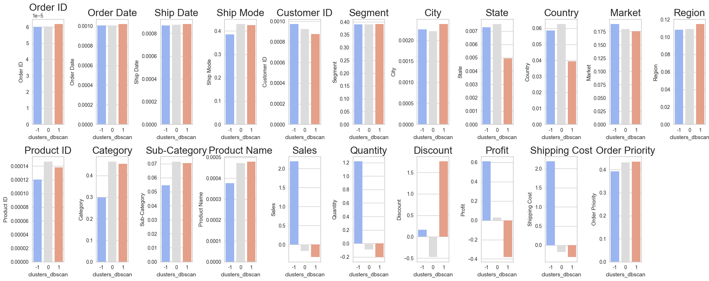
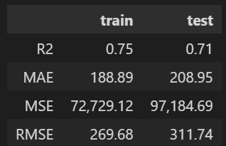
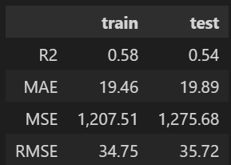
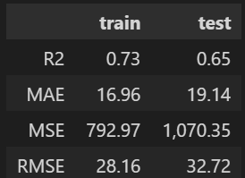
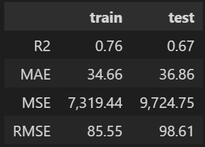
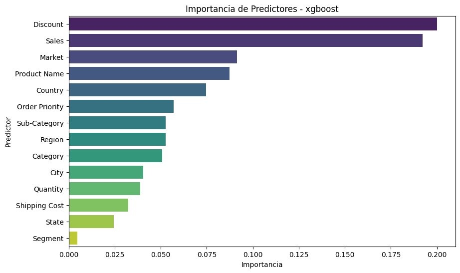

# Proyecto 9 Clustering y Modelos de Regresión

## Explicación del Proyecto

En este proyecto, asumirás el rol de cientifico de datos en una empresa de comercio global. La compañía busca comprender mejor su base de clientes, productos y operaciones para tomar decisiones informadas que maximicen el beneficio y optimicen sus procesos.

Trabajarás con un conjunto de datos del comercio global que incluye información sobre ventas, envíos, costos y beneficios a nivel de cliente y producto. Tu tarea será segmentar los datos mediante clustering y luego diseñar modelos de regresión específicos para cada segmento, lo que permitirá obtener insights personalizados sobre los factores que influyen en el éxito de la compañía.

## Objetivos del Proyecto

La empresa tiene las siguientes preguntas clave:

- ¿Cómo podemos agrupar a los clientes o productos de manera significativa?

- ¿Qué factores son más relevantes para predecir el beneficio o las ventas dentro de cada grupo?

- ¿Cómo podemos utilizar estos insights para tomar decisiones estratégicas?

Para contestar estas preguntas, el objetivo en este proyecto es realizar:

- Clustering: Realizar un análisis de segmentación para agrupar clientes o productos según características clave, las cuales deberás elegir personalmente además de justificar el porque de su elección.

- Regresión por Segmentos: Diseñar modelos de predicción para cada segmento, explicando las relaciones entre variables, intentando predecir el total de ventas en cada uno de los segmentos.

## Estructura del Proyecto

El proyecto está construido de la siguiente manera:

- **datos/**: Carpeta que contiene archivos `.csv` con los datos del proyecto, tanto dados, como generados con clusters

- **images/**: Carpeta que contiene archivos de imagen generados durante la ejecución del código o de fuentes externas.

- **notebooks/**: Carpeta que contiene los archivos `.ipynb` utilizados en la captura y tratamiento de los datos. Están numerados para su ejecución secuencial, y contenidos dentro de 3 carpetas, una para cada modelo, conteniendo las de los modelos 1 y 2:
  - `1-clusterizacion`
  - `2-modelos-con-clusters`
  - `3-modelos-sinc-clusters`
    
- **src/**: Carpeta que contiene los archivos `.py`, con las funciones y variables utilizadas en los distintos notebooks.

- `.gitignore`: Archivo que contiene los archivos y extensiones que no se subirán a nuestro repositorio, como los archivos .env, que contienen contraseñas.

## Construido con

* [Pyhton](https://www.python.org/) - Lenguaje utilizado
* [Numpy](https://numpy.org/doc/stable/) - Numpy
* [seaborn](https://seaborn.pydata.org/tutorial.html) - Seaborn
* [matplotlib](https://matplotlib.org/stable/users/index) - matplotlib
* [pandas](https://pandas.pydata.org/docs/) - pandas
* [scikit-learn](https://scikit-learn.org/stable/user_guide.html) - scikit-learn
* [Visual Studio Code](https://code.visualstudio.com/) - IDE desarrollo                             |

## Resultados y conclusiones

Obtenemos tres clusters on el método Dbscan

Al aplicar modelos de Regresión sobre los 3 clusters obtenemos las siguientes metricas

**Cluster -1**

**Cluster 0**

**Cluster 1**

- Los modelos de regresión predicen mejor en los clusters 0 y 1 que en el -1. Una posible explicación es que lso datos de ese cluster sean outliers, o muchos de ellso al menos.

- Las metricas no son buenas, lo que sugiere que los clusters definidos o los modelos de predicción son mejorables.

- En todos los modelos de regresion las variables de más importancia para hacer las predicciones de beneficios son "Discount" y "Sales". habría que tratar de aumentar las ventas y minimizar los descuentos. Teniendo en cuenta que si no hay descuentos o demasiado pocos, subirán los precios lo que puede repercutir negativamente en las ventas.

- El beneficio es más bajo en los clusters 0 y 1, y es ahí donde habría que poner enfasis en mejorar los beneficios. En el -1 son bastante altos

**Modelo sin clusters**

- Con el dataframe unido obtenemos peores predicciones queen los clusters 0 y 1

- Los descuentos ("Discounts") y las ventas ("Sales") son los que mayor importancia tienen en la predicción del modelo. Así que serán las variables a ajsutar preferentemente para maximizar el beneficio.

## Propuestas de Mejora:

- Utilizar streamlit para construir una web.

- Introducir mejoras en el preprocesamiento (probar un tratamiento diferente de outliers y probar otros métodos de estandarización y enconding en los modelos de regresión)

## Autor ✒️

* **Rafael Castellot de Miguel** - [rcm89](https://github.com/Rcm89)
